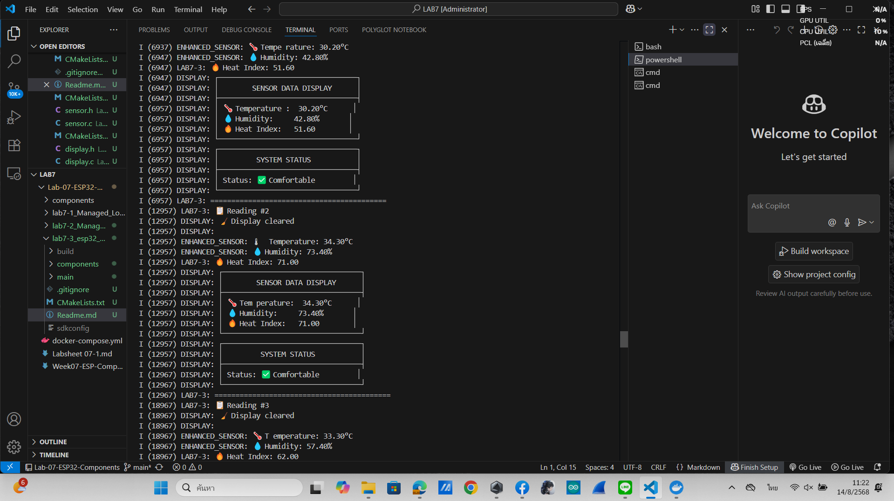

# ผลลัพธ์ 7.3 
root@b35f767591b4:/project/lab7-3_esp32_Component# idf.py qemu
Adding "qemu"'s dependency "all" to list of commands with default set of options.
Executing action: all (aliases: build)
Running ninja in directory /project/lab7-3_esp32_Component/build
Executing "ninja all"...
[1/4] cd /project/lab7-3_esp32_Component/build/esp-idf/...le.bin /project/lab7-3_esp32_Component/build/lab7-3.bin 
lab7-3.bin binary size 0x299e0 bytes. Smallest app partition is 0x100000 bytes. 0xd6620 bytes (84%) free.
[1/1] cd /project/lab7-3_esp32_Component/build/bootload.../lab7-3_esp32_Component/build/bootloader/bootloader.bin 
Bootloader binary size 0x66a0 bytes. 0x960 bytes (8%) free.
[4/4] Completed 'bootloader'Executing action: qemu
Generating flash image: /project/lab7-3_esp32_Component/build/qemu_flash.bin
esptool.py --chip=esp32 merge_bin --output=/project/lab7-3_esp32_Component/build/qemu_flash.bin --fill-flash-size=2MB --flash_mode dio --flash_freq 40m --flash_size 2MB 0x1000 bootloader/bootloader.bin 0x10000 lab7-3.bin 0x8000 partition_table/partition-table.bin
esptool.py v4.9.0
SHA digest in image updated
Wrote 0x200000 bytes to file /project/lab7-3_esp32_Component/build/qemu_flash.bin, ready to flash to offset 0x0
Generating efuse image: /project/lab7-3_esp32_Component/build/qemu_efuse.bin
Running qemu (fg): qemu-system-xtensa -M esp32 -m 4M -drive file=/project/lab7-3_esp32_Component/build/qemu_flash.bin,if=mtd,format=raw -drive file=/project/lab7-3_esp32_Component/build/qemu_efuse.bin,if=none,format=raw,id=efuse -global driver=nvram.esp32.efuse,property=drive,value=efuse -global driver=timer.esp32.timg,property=wdt_disable,value=true -nic user,model=open_eth -nographic -serial mon:stdio
Adding SPI flash device
ets Jul 29 2019 12:21:46

rst:0x1 (POWERON_RESET),boot:0x12 (SPI_FAST_FLASH_BOOT)
configsip: 0, SPIWP:0xee
clk_drv:0x00,q_drv:0x00,d_drv:0x00,cs0_drv:0x00,hd_drv:0x00,wp_drv:0x00
mode:DIO, clock div:2
load:0x3fff0030,len:6372
load:0x40078000,len:15928
load:0x40080400,len:3880
entry 0x40080638
I (978) boot: ESP-IDF v6.0-dev-1002-gbfe5caf58f 2nd stage bootloader
I (980) boot: compile time Aug 14 2025 04:16:59
I (981) boot: Multicore bootloader
I (1359) boot: chip revision: v3.0
I (1361) boot.esp32: SPI Speed      : 40MHz
I (1362) boot.esp32: SPI Mode       : DIO
I (1362) boot.esp32: SPI Flash Size : 2MB
I (1416) boot: Enabling RNG early entropy source...
I (1471) boot: Partition Table:
I (1472) boot: ## Label            Usage          Type ST Offset   Length
I (1472) boot:  0 nvs              WiFi data        01 02 00009000 00006000
I (1473) boot:  1 phy_init         RF data          01 01 0000f000 00001000
I (1474) boot:  2 factory          factory app      00 00 00010000 00100000
I (1522) boot: End of partition table
I (1938) esp_image: segment 0: paddr=00010020 vaddr=3f400020 size=0a0b4h ( 41140) map
I (2149) esp_image: segment 1: paddr=0001a0dc vaddr=3ff80000 size=00024h (    36) load
I (2336) esp_image: segment 2: paddr=0001a108 vaddr=3ffb0000 size=02600h (  9728) load
I (2516) esp_image: segment 3: paddr=0001c710 vaddr=40080000 size=03908h ( 14600) load
I (2707) esp_image: segment 4: paddr=00020020 vaddr=400d0020 size=10290h ( 66192) map
I (2892) esp_image: segment 5: paddr=000302b8 vaddr=40083908 size=096f8h ( 38648) load
I (3564) boot: Loaded app from partition at offset 0x10000
I (3565) boot: Disabling RNG early entropy source...
I (3630) cpu_start: Multicore app
I (6814) cpu_start: Pro cpu start user code
I (6815) cpu_start: cpu freq: 160000000 Hz
I (6816) app_init: Application information:
I (6816) app_init: Project name:     lab7-3
I (6816) app_init: App version:      eace49b-dirty
I (6817) app_init: Compile time:     Aug 14 2025 04:16:44
I (6818) app_init: ELF file SHA256:  6c3a2c58f...
I (6818) app_init: ESP-IDF:          v6.0-dev-1002-gbfe5caf58f
I (6819) efuse_init: Min chip rev:     v0.0
I (6819) efuse_init: Max chip rev:     v3.99
I (6820) efuse_init: Chip rev:         v3.0
I (6821) heap_init: Initializing. RAM available for dynamic allocation:
I (6822) heap_init: At 3FFAE6E0 len 00001920 (6 KiB): DRAM
I (6823) heap_init: At 3FFB2EC8 len 0002D138 (180 KiB): DRAM
I (6824) heap_init: At 3FFE0440 len 00003AE0 (14 KiB): D/IRAM
I (6824) heap_init: At 3FFE4350 len 0001BCB0 (111 KiB): D/IRAM
I (6826) heap_init: At 4008D000 len 00013000 (76 KiB): IRAM
I (6884) spi_flash: detected chip: winbond
I (6890) spi_flash: flash io: dio
I (6907) main_task: Started on CPU0
I (6917) main_task: Calling app_main()
I (6917) LAB7-3: � Lab 7-3: Custom Components Demo (sensor + display) Started
I (6917) LAB7-3: 📦 Using components created with idf.py create-component
I (6917) ENHANCED_SENSOR: 🔧 Enhanced Sensor Component initialized
I (6917) ENHANCED_SENSOR: 📍 File: ./components/sensor/sensor.c, Line: 14
I (6927) ENHANCED_SENSOR: ✅ GPIO LED configured on pin 2
I (6927) DISPLAY: 🖥️  Display Component initialized
I (6927) DISPLAY: 📍 File: ./components/display/display.c, Line: 11
I (6927) DISPLAY: ✅ Virtual display ready for operation
I (6927) LAB7-3: 📋 Reading #1
I (6927) DISPLAY: 🧹 Display cleared
I (6927) DISPLAY:
I (6937) ENHANCED_SENSOR: 🌡️  Tempe rature: 30.20°C
I (6947) ENHANCED_SENSOR: 💧 Humidity: 42.80%
I (6947) LAB7-3: 🔥 Heat Index: 51.60
I (6947) DISPLAY: ┌─────────────────────────────────┐
I (6947) DISPLAY: │        SENSOR DATA DISPLAY      │
I (6947) DISPLAY: ├─────────────────────────────────┤
I (6957) DISPLAY: │ 🌡️  Temperature :  30.20°C      │
I (6957) DISPLAY: │ 💧 Humidity:     42.80%       │
I (6957) DISPLAY: │ 🔥 Heat Index:   51.60        │
I (6957) DISPLAY: └─────────────────────────────────┘
I (6957) DISPLAY: ┌─────────────────────────────────┐
I (6957) DISPLAY: │         SYSTEM STATUS           │
I (6957) DISPLAY: ├─────────────────────────────────┤
I (6957) DISPLAY: │ Status: ✅ Comfortable         │
I (6957) DISPLAY: └─────────────────────────────────┘
I (6957) LAB7-3: ==========================================
I (12957) LAB7-3: 📋 Reading #2
I (12957) DISPLAY: 🧹 Display cleared
I (12957) DISPLAY:
I (12957) ENHANCED_SENSOR: 🌡 ️  Temperature: 34.30°C
I (12957) ENHANCED_SENSOR: 💧 Humidity: 73.40%
I (12957) LAB7-3: 🔥 Heat Index: 71.00
I (12957) DISPLAY: ┌─────────────────────────────────┐
I (12957) DISPLAY: │        SENSOR DATA DISPLAY      │
I (12957) DISPLAY: ├─────────────────────────────────┤
I (12957) DISPLAY: │ 🌡️  Tem perature:  34.30°C      │
I (12957) DISPLAY: │ 💧 Humidity:     73.40%       │
I (12957) DISPLAY: │ 🔥 Heat Index:   71.00        │
I (12957) DISPLAY: └─────────────────────────────────┘
I (12957) DISPLAY: ┌─────────────────────────────────┐
I (12957) DISPLAY: │         SYSTEM STATUS           │
I (12967) DISPLAY: ├─────────────────────────────────┤
I (12967) DISPLAY: │ Status: ✅ Comfortable         │
I (12967) DISPLAY: └─────────────────────────────────┘
I (12967) LAB7-3: ==========================================
I (18967) LAB7-3: 📋 Reading #3
I (18967) DISPLAY: 🧹 Display cleared
I (18967) DISPLAY:
I (18967) ENHANCED_SENSOR: 🌡️  T emperature: 33.30°C
I (18967) ENHANCED_SENSOR: 💧 Humidity: 57.40%
I (18967) LAB7-3: 🔥 Heat Index: 62.00
I (18967) DISPLAY: ┌─────────────────────────────────┐
I (18967) DISPLAY: │        SENSOR DATA DISPLAY      │
I (18967) DISPLAY: ├─────────────────────────────────┤
I (18967) DISPLAY: │ 🌡️  Tempera ture:  33.30°C      │
I (18967) DISPLAY: │ 💧 Humidity:     57.40%       │
I (18967) DISPLAY: │ 🔥 Heat Index:   62.00        │
I (18967) DISPLAY: └─────────────────────────────────┘
I (18967) DISPLAY: ┌─────────────────────────────────┐
I (18977) DISPLAY: │         SYSTEM STATUS           │
I (18977) DISPLAY: ├─────────────────────────────────┤
I (18977) DISPLAY: │ Status: ✅ Comfortable         │
I (18977) DISPLAY: └─────────────────────────────────┘
I (18977) LAB7-3: ==========================================

